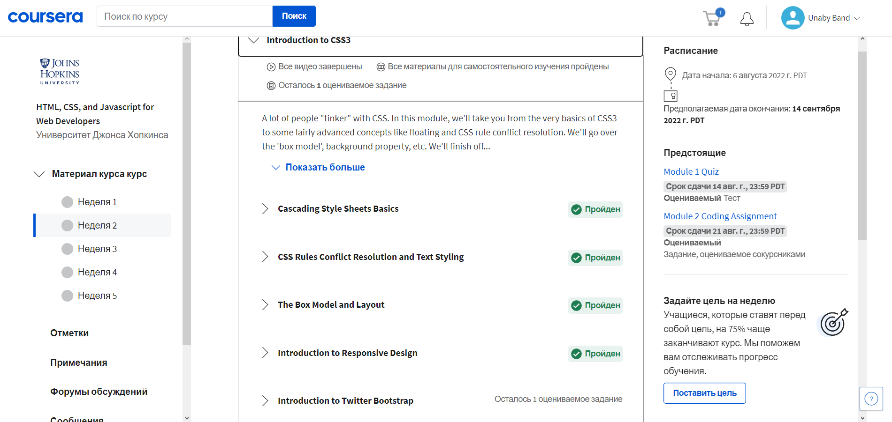

# kottans-frontend

Repository for Front-End Course Kottans

## GitIntro

Прослухав перший і другий тижні курсу Introduction to Git and GitHub. 
Вияснив що являють собою системи контролю якості (VCS) взагалі і Git зокрема, та яка їхня роль у сучасній розробці проектів.
Це система базових робочих середовищ (репозиторіїв), яка дозволяє ефективно співпрацювати різним гілкам/розробникам коду між собою. Цікавим для мене (як системного адміністратора в минулому) також виявися той факт, що створенням Git займався Лінус Торвальдс, людина що свого часу створила OS Linux.
Окрім цього ознайомився з базовим набором команд для Git, та спробував їхнє використання у тестових прикладах.

**Сompleted course "How to use Git and GitHub"**

 

## learngitbranching.js.org

Також пройшов вказані рівні на learngitbranching.js.org - весела штука :)

## Linux CLI

Команди Linux - done! Насправді, цей етап навчання не виявився для мене новим, адже свого часу я працював системним адміністратором
і про Linux (та інші UNIX-системи) уявлення мав. Але "освіжити" знання ніколи не завадить, особливо якщо це база!

## Git collaboration

Git collaboration - done! Цікава і вочевидь корисна для майбутньої професії тема. Логіка роботи VCS Git - не завжди виявляється очевидною, але завдяки чудовим візуалізованим рівням learngitbranching.js.org, матеріал засвоюється із задоволенням. 
Наскільки, що навіть спробував вирішити задачі з необов'язкових рівнів, хочу повернутися до них пізніше - прикольний інтерактив :)

## Intro to HTML and CSS

Прослухав перші два тижні курсу Introduction to Responsive Design, було інформативно та досить наглядно. Матеріал виявився практично новим, так як раніше я майже не вивчав HTML та CSS. В той же час, багато чого було зрозуміло з першого разу. Здивувало, або точніше трохи заплутало пояснення flow документа Html, в курсах Codeacademy (які я проходив далі) всі ці речі були пояснені більш просто та детально. 
Окремо запам'ятався Twitter BootStrap та поділ вмісту веб-сторінки на 12 частин, як я розумію - це наріжний камінь майбутньої професії frontend-розробника.

ФУУУХ, а це вже було насправді - корисно, об'ємно та практично! Завдяки цьому курсу я набагато краще засвоїв матеріал із попередньої частини завдання, навіть вдалося трошки поекспериментувати (в рамках завдань, звісно) з CSS-файлом.
Ура, рухаємося далі. Break the leg!